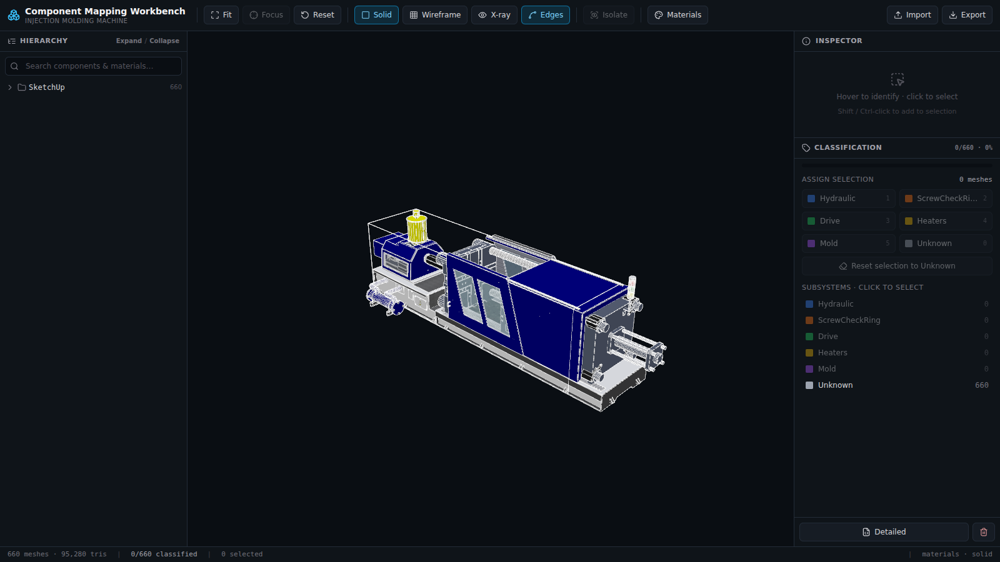

# Machine Component Mapping Workbench

A standalone engineering tool to **inspect, classify, and export** the components
of an injection-molding machine 3D model into predictive-maintenance subsystems.

Domain experts visually identify geometry and assign every mesh to a subsystem
(Hydraulic · ScrewCheckRing · Drive · Heaters · Mold · Unknown). The tool exports
a portable `component-map.json` that a downstream digital twin uses to drive
component health, remaining-useful-life overlays, fault highlighting, and
subsystem analytics.



> The supplied SketchUp/COLLADA model has **no meaningful node names** (just
> `group_0`, `instance_42`); the only semantic hints are material names. The
> workbench is therefore built around **visual inspection** — hover, isolate,
> x-ray, focus, and a hierarchy explorer — not name search.

## Quick start

```bash
cd workbench
npm install
npm run dev            # http://localhost:5173
```

Production build + serve:

```bash
npm run build
npm run serve          # http://localhost:4173
```

Or use the all-in-one launcher (also handles remote sharing):

```bash
./run-workbench.sh             # build if needed + serve
./run-workbench.sh --tunnel    # also open a public Cloudflare URL
PORT=8080 ./run-workbench.sh   # choose the port
```

## Using the workbench

| Action | How |
|---|---|
| **Identify** a part | Hover — a label shows its name + material |
| **Select** | Click · Shift/Ctrl-click to add · click empty space to clear |
| **Navigate** | Hierarchy tree (left) — search, expand/collapse; picks sync both ways |
| **Inspect closely** | Toolbar: **Isolate**, **Wireframe**, **X-ray**, **Edges**, **Focus**, **Fit** |
| **Classify** | Select, then a subsystem button (right) or hotkeys `1–5`,`0` |
| **Classify a group** | Click a group in the tree (selects all its meshes), then assign |
| **See assignments** | Toolbar **Materials ↔ Class colors** toggle |
| **Export** | Toolbar **Export** → `component-map.json`; **Detailed** for metadata |
| **Resume** | Assignments auto-save locally; **Import** a previous map to continue |

Keyboard: `1–5` / `0` assign · `F` focus · `I` isolate · `Esc` exit isolation / clear.

## Export format

`component-map.json` is the exact contract — a complete, lossless partition of the
model (every mesh appears exactly once; unassigned meshes are `Unknown`):

```json
{
  "Hydraulic": ["SketchUp/group_0/group_16/instance_65/node#4", "..."],
  "ScrewCheckRing": [],
  "Drive": [],
  "Heaters": [],
  "Mold": [],
  "Unknown": ["..."]
}
```

Ids are **stable, deterministic node-name paths**, so the file keeps referring to
the same geometry across reloads and machines. `component-map.detailed.json` adds
per-mesh metadata (material, triangle count, parent) and derived group ids for
direct digital-twin consumption.

## Remote collaborative sessions (Phase 8)

1. Develop & verify locally.
2. Commit and clone on the DGX machine.
3. `./run-workbench.sh --tunnel` → share the printed `*.trycloudflare.com` URL.
4. Developer + client classify together on the **same** instance.
5. Export the final `component-map.json`.

The Vite servers bind `0.0.0.0` with `allowedHosts: true` (see
[vite.config.ts](vite.config.ts)) so tunnel hostnames work out of the box.

## Tech

React 19 · TypeScript (strict) · Three.js · React Three Fiber · drei ·
postprocessing · Zustand · Tailwind · Vite.

## Project docs

- [IMPLEMENTATION_PLAN.md](IMPLEMENTATION_PLAN.md) — phases & status
- [TASKS.md](TASKS.md) — task board
- [ARCHITECTURE.md](ARCHITECTURE.md) — structure & data flow
- [DECISIONS.md](DECISIONS.md) — key decisions & trade-offs
